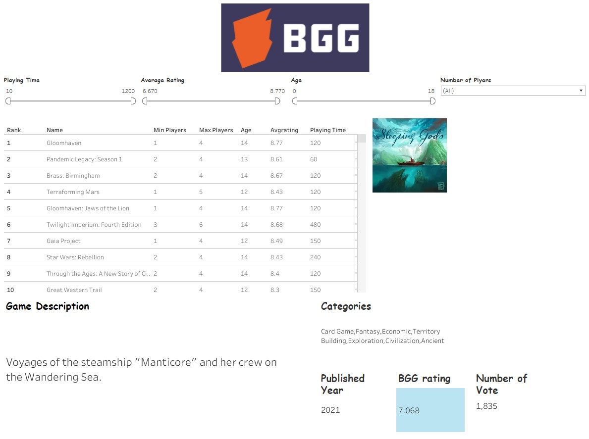

# boardgame-searching-tool

The main product of this repo is boardgame searching tool that users can find boardgames that they want.
Searching keywords include: Age, game categories, number of players, playing time and rating of games.
Dataset for this tool is acquired from BoardGameGeek website which is large database for the boardgame.

## Technologies
-xml API

-Python

-Excel

-Tableau

## Process

## Difficulties
-Using xml format API was challenge part in this project. 'xml.etree.ElementTree' module solve this problem for this project.

(Fun fact) There was bug on website on August 9. All the numbers on ranking page went n/a so couldn't get the data and delay the process.
